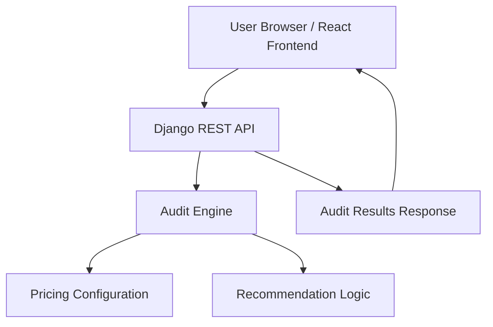

# Architecture Overview

## System Design

---

# Data Flow

1. User opens the React frontend application.
2. User inputs AI tooling details including:
   - tool
   - pricing plan
   - monthly spend
   - seats
   - use case
   - team size

3. Frontend persists form state using localStorage.

4. On audit generation:
   - frontend sends POST request to Django REST API
   - request contains structured audit payload

5. Django backend processes:
   - pricing lookup
   - overspending detection
   - downgrade opportunities
   - savings calculations
   - recommendation generation

6. Backend returns:
   - monthly savings
   - annual savings
   - per-tool recommendations
   - reasoning and optimization suggestions

7. Frontend renders audit dashboard UI dynamically.

---

# Stack Decisions

## Frontend — React + Vite

Reasons:
- fast development workflow
- lightweight setup
- excellent developer experience
- simple deployment on Vercel

Vite was chosen over Next.js because:
- SEO was not critical for MVP phase
- backend API was already separated
- faster iteration speed for rapid shipping

---

## Backend — Django REST Framework

Reasons:
- rapid API development
- clean project structure
- scalable backend architecture
- reliable request handling

DRF simplified:
- API routing
- JSON serialization
- future authentication support

---

# Pricing Engine Design

Pricing logic is centralized inside a configurable pricing dictionary.

Benefits:
- scalable plan additions
- easier maintenance
- cleaner recommendation logic
- separation of business logic from UI

The audit engine compares:
- current spend
- estimated official pricing
- plan suitability
- optimization opportunities

---

# State Management

React useState hooks manage:
- dynamic multi-tool forms
- audit results
- team size
- validation state

localStorage persists:
- audit form state
- multi-tool entries
- team size

This improves UX by preventing accidental data loss during reloads.

---

# Deployment Architecture

## Frontend
- Hosted on Vercel
- Automatic redeploys from GitHub

## Backend
- Hosted on Render
- Django served using Gunicorn

---

# Scaling Considerations (10k audits/day)

If scaled further:

## Backend Improvements
- move pricing data to database
- add Redis caching
- async task queue for AI summaries
- rate limiting and abuse protection

## Frontend Improvements
- analytics dashboard
- lazy-loaded visualizations
- CDN asset optimization

## Infrastructure Improvements
- PostgreSQL database
- Docker containerization
- CI/CD pipelines
- monitoring and logging

---

# Security Considerations

- No secrets stored in repository
- CORS configured for deployed frontend
- Backend isolated from frontend deployment
- Basic frontend validation implemented

---

# Future Improvements

- AI-generated personalized summaries
- Shareable public audit links
- PDF export support
- Email report delivery
- Benchmarking against similar startups
- Historical spend tracking